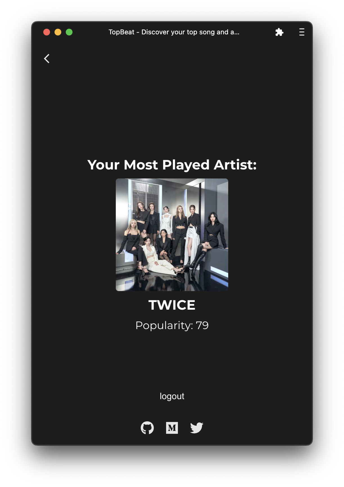

# 🎧 TopBeat

### Deployment Status : 
[](https://topbeat.pages.dev) 
 
[](https://topbeat.danials.space) 

### Documents : 
[](https://ghost.danials.space/topbeat/) 
[](https://medium.danials.space/topbeat-e24a96d77cdd) 

### Technologies and Services : 
 
 


# Screenshots:
<p float="left">
  
  
   
  
</p>

Discover your 🔝 song and 🎤 artist with our music app! Connect your 🎧 Spotify account, and we'll show your most-played track. 💡 Stylish. Simple. Start listening! 🎶

## 🚀 Quick Start
Clone the repository:
```bash
git clone https://github.com/danialdot/topbeat.git
cd topbeat
```

Install dependencies:
```bash
npm install
```

Add your Spotify Client ID:

Open src/components/LoginPage.js. Replace 'YOUR_SPOTIFY_CLIENT_ID' with your actual Spotify App Client ID.


Run the app:
```bash
npm start
```

Open your web browser and navigate to http://localhost:3000 to access TopBeat.

## 🛠️ Tech Stack
- React.js: Frontend UI library
- Spotify Web API: Fetching user's top tracks and artist information
- Material-UI: Icons for the iOS-style back button
- Local Storage: Caching the Spotify access token for future visits

## 📝 License
This project is licensed under the MIT License. See the LICENSE file for details.